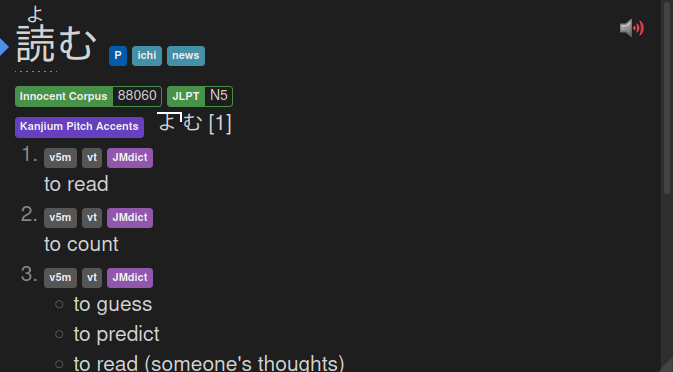

# yomichan-jlpt-vocab
This meta dictionary adds JLPT-level tags to words in Yomichan.

## Attribution

JLPT data is sourced from [Jonathan
Waller‘s](http://www.tanos.co.uk/contact/) [JLPT
Resources](http://www.tanos.co.uk/jlpt/) page under the terms of
the Creative Commons BY license. This is the same resource used
by [jisho](https://jisho.org/), so the information found there
should be roughly equivalent.

Alternative headword forms (e.g., variations of あかい: 赤い, 紅い, 
朱い, 緋い, 赭い, 丹い) are sourced from [The JMDict
Project](https://www.edrdg.org/jmdict/j_jmdict.html) under the
terms of the Creative Commons Attribution-ShareAlike
Licence (V3.0).

## Install

Download the zip file from the [latest
release](https://github.com/stephenmk/yomichan-jlpt-vocab/releases/latest)
and import it into Yomichan just like any other dictionary.

## Build from source

1. Clone this repository
2. Run the provided Python script within the project directory
    - This will produce a new directory named JLPT
3. Zip the contents of JLPT directory
    - Files must be in the top-level of the zip file, i.e., not
      within any sub-folders
4. Import the zip file into Yomichan
